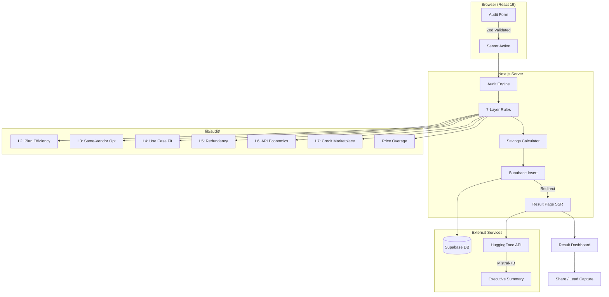

# ARCHITECTURE.md

## System Overview

The AI Spend Audit tool is a Next.js 16 web application that helps companies identify overspend on AI subscriptions. The core idea is simple: you tell us what you pay, we tell you what you *should* be paying.

The entire financial logic is deterministic — no LLM decides your savings number. We use AI only at the very end, to write a human-readable paragraph summarizing what the math already calculated.

---

## System Diagram

---

## Data Flow: Input → Audit Result

1. **User fills the form** — company name, team size, primary use case, and a list of AI tools with plan + spend + seats.
2. **Zod validates** the input client-side. If it passes, the form calls a Next.js Server Action (`submitAudit`).
3. **Server Action runs the engine** — `runAudit()` takes the validated input and loops every tool through 7 evaluation layers.
4. **Each layer returns 0 or 1 recommendation** per tool. Recommendations include the exact dollar savings, a confidence level, and which layer generated it.
5. **Engine computes totals** — current spend, optimized spend, monthly/annual savings, a verdict string, and metadata (savings %, top opportunity).
6. **Result is persisted to Supabase** — the full `AuditResult` JSON goes into the `audits` table alongside the raw input.
7. **User is redirected** to `/result/[id]` where the page fetches the record server-side (SSR) and passes it to `ResultClient`.
8. **ResultClient renders the dashboard** — Savings Hero, Recharts visualization, recommendation cards, benchmarking, and CTA section.
9. **In parallel**, the client calls the HuggingFace Inference API to generate a natural-language executive summary using Mistral-7B. This is purely cosmetic — if the API fails, a deterministic fallback summary is shown instead.

---

## Why This Stack

| Choice | Why |
|---|---|
| **Next.js 16 (App Router)** | Server Actions eliminate a separate API layer. Server-side rendering makes result pages instantly shareable and SEO-ready. |
| **Supabase** | Free tier, instant Postgres, and a JS client that works in both server and client contexts. No ORM overhead for an MVP. |
| **Zod** | Runtime validation at the form boundary ensures the engine never receives garbage data. |
| **Recharts** | The only React charting library that worked cleanly with React 19 without compatibility warnings. |
| **Vitest** | Fast, ESM-native test runner. Since the audit engine is pure functions, tests run in milliseconds. |
| **HuggingFace Inference API** | Free access to Mistral-7B via a simple `fetch` call. No SDK, no API key rotation complexity. |
| **TailwindCSS v4** | Utility-first CSS that ships zero unused styles. The dark fintech theme was built entirely with Tailwind tokens. |

---

## What I'd Change at 10k Audits/Day

Right now this handles maybe 50-100 audits/day comfortably on Vercel's free tier. To scale to 10,000:

1. **Move the pricing catalog to a database table** — Currently it's a static TypeScript object. At scale, I'd want to update pricing without redeploying. A simple `tool_pricing` table in Supabase with a 1-hour cache in Redis would work.

2. **Queue the AI summary generation** — The HuggingFace call adds 2-3 seconds of latency. I'd move it to a background job (Inngest or Supabase Edge Functions) and show the dashboard immediately with a "Summary generating..." skeleton.

3. **Add rate limiting** — A simple token-bucket rate limiter on the `/api/leads` and Server Action endpoints to prevent abuse. Upstash Redis is the obvious choice here.

4. **Shard the Supabase reads** — Result pages are read-heavy. I'd add Vercel Edge caching with `stale-while-revalidate` headers so repeated visits to the same `/result/[id]` don't hit the database.

5. **Replace the monolithic rules loop** — At 10k/day with potentially 50+ rules, I'd restructure the engine to run layers in parallel using `Promise.all`, since each layer is independent.

6. **Add observability** — Structured logging with something like Axiom or Datadog, plus error tracking with Sentry. Right now errors just go to `console.error`.
